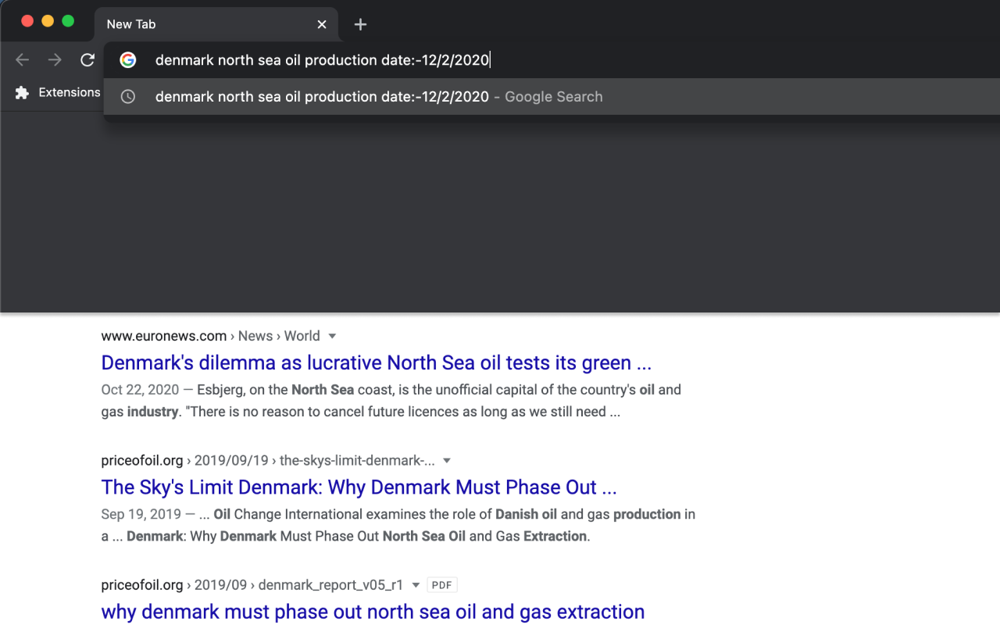
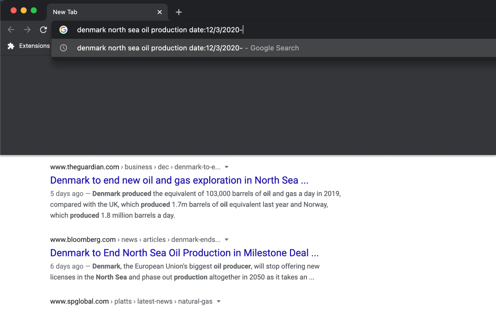
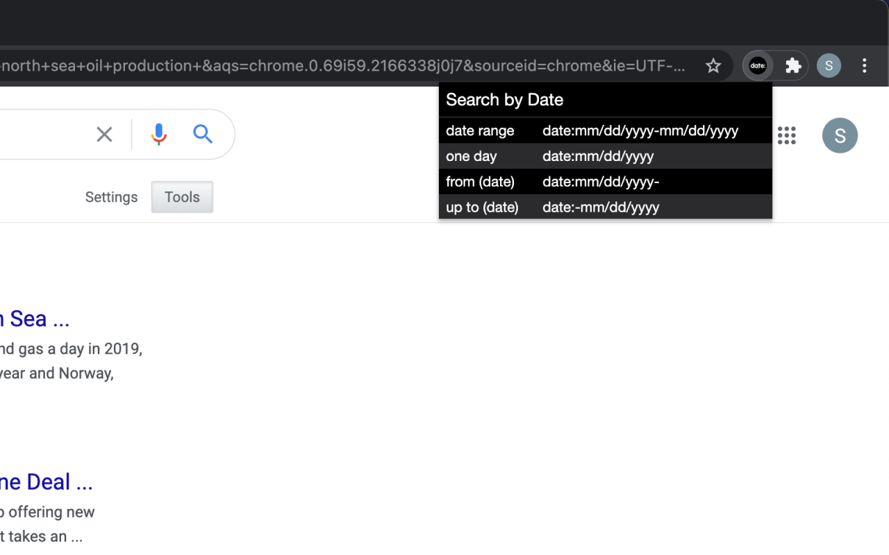

# Search by Date

A tool which allows to customize search results by date. An efficient alternative to Chrome's "Tools ⟶ Any time ⟶ Custom range ⟶ From ⟶ To ⟶ Go" sequence.

There are 4 ways to specify a date:

1. Date range – date:mm/dd/yyyy-mm/dd/yyyy
2. One day – date:mm/dd/yyyy
3. From (date) – date:mm/dd/yyyy-
4. Up to (date) – date:-mm/dd/yyyy

Don't add spaces. Hereafter this information can be referenced through a popup (open it by clicking an extension icon displayed in the top right corner of the browser). Only United States date format (mm/dd/yyyy) is currently supported.

#### Chrome Web Store: https://chrome.google.com/webstore/detail/search-by-date/cdhckogdanaloniccgjgfjgngmgkelee

